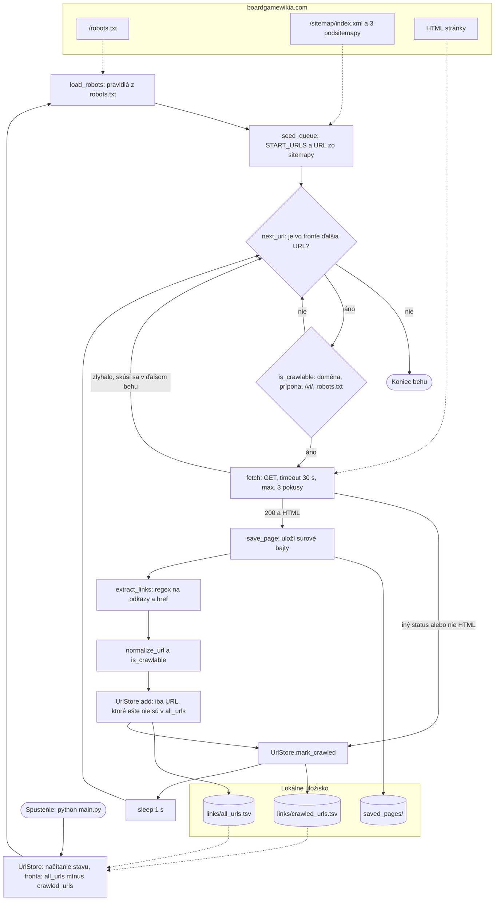

```mermaid
flowchart TD

subgraph WEB ["boardgamewikia.com"]
ROBOTS["/robots.txt"]
SITEMAP["/sitemap/index.xml a 3 podsitemapy"]
PAGES["HTML stránky"]
end

subgraph DISK ["Lokálne úložisko"]
ALL[("links/all_urls.tsv")]
CRAWLED[("links/crawled_urls.tsv")]
SAVED[("saved_pages/")]
end

START(["Spustenie: python main.py"]) --> LOAD["UrlStore: načítanie stavu, fronta: all_urls mínus crawled_urls"]
ALL -.-> LOAD
CRAWLED -.-> LOAD
LOAD --> ROB["load_robots: pravidlá z robots.txt"]
ROBOTS -.-> ROB
ROB --> SEED["seed_queue: START_URLS a URL zo sitemapy"]
SITEMAP -.-> SEED
SEED --> NEXT{"next_url: je vo fronte ďalšia URL?"}
NEXT -- nie --> STOP(["Koniec behu"])
NEXT -- áno --> CHECK{"is_crawlable: doména, prípona, /vi/, robots.txt"}
CHECK -- nie --> NEXT
CHECK -- áno --> FETCH["fetch: GET, timeout 30 s, max. 3 pokusy"]
PAGES -.-> FETCH
FETCH -- zlyhalo, skúsi sa v ďalšom behu --> NEXT
FETCH -- iný status alebo nie HTML --> MARK
FETCH -- 200 a HTML --> SAVE["save_page: uloží surové bajty"]
SAVE --> SAVED
SAVE --> EXTRACT["extract_links: regex na odkazy a href"]
EXTRACT --> FILTER["normalize_url a is_crawlable"]
FILTER --> ADD["UrlStore.add: iba URL, ktoré ešte nie sú v all_urls"]
ADD --> ALL
ADD --> MARK["UrlStore.mark_crawled"]
MARK --> CRAWLED
MARK --> SLEEP["sleep 1 s"]
SLEEP --> NEXT
```
